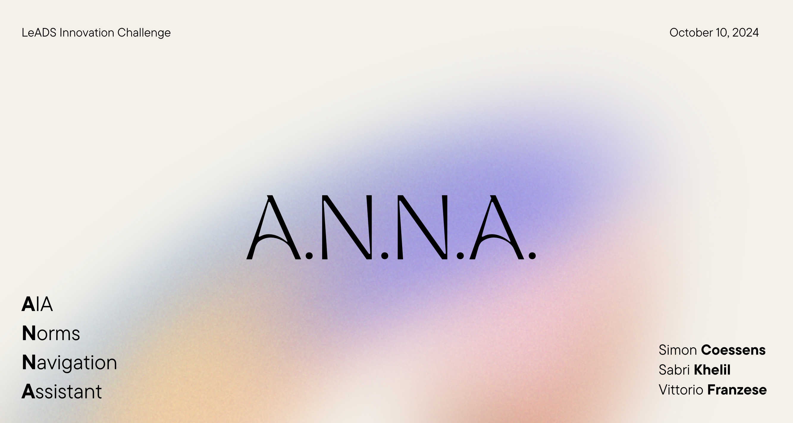

<a href='https://github.com/data-jurists/LICENSE'>MIT License</a>

</a>

 

---

### A.N.N.A. is your assistant to navigate AI regulations! 🚀

- **Web**: Visit [https://datajurists.streamlit.app/](https://datajurists.streamlit.app/) to explore how A.N.N.A. can help you.
   
   

# 🧐 Project Overview

> A.N.N.A. (AI Act Norms Navigation Assistant) is designed to help developers, organizations, and legal teams assess compliance with the EU AI Act.
>
> By providing easy access to the complex legal framework of the AI Act, A.N.N.A. empowers users to understand their AI system’s obligations with accuracy and ease. A.N.N.A. supports both general AI systems and high-risk applications, ensuring legal adherence at every step.

## 🏆 Awards and Recognition

We are proud to announce that **A.N.N.A.** won the **1st Prize** and was recognized as the **Most Innovative Solution** at the **LEADS Innovation Challenge**!

You can learn more about the competition and our achievement on the official [LEADS Innovation Challenge webpage](https://www.legalityattentivedatascientists.eu).

This award acknowledges our commitment to delivering an innovative, legally accurate, and user-friendly tool to navigate the complexities of the EU AI Act. We are thrilled to continue enhancing A.N.N.A. and helping businesses stay compliant with evolving AI regulations.

## 📹 Demo Videos

Here are some demo videos showcasing A.N.N.A.’s key features and functionalities:

### Demo 1: Introduction to A.N.N.A.

https://github.com/user-attachments/assets/2aa5f5ba-f971-4e11-a955-8f0c00bf3b61

### Demo 2: Navigating the AI Act

https://github.com/user-attachments/assets/f9b8e891-cef4-4196-bd25-e3a28a802c5f

## 👥 Meet the Team

  

 

# 👨‍💻 Tech Stack

Here’s a brief overview of the tech stack powering A.N.N.A.:

- **Frontend**: A.N.N.A. uses [Streamlit](https://streamlit.io/) for an interactive web interface, making it simple and accessible for users without technical backgrounds.
- **Backend**: The system is built on the [LangChain](https://langchain.com/) framework, combined with OpenAI APIs to deliver accurate and up-to-date legal advice.
- **Database**: Legal documents and AI system data are managed using a [Pinecone](https://www.pinecone.io/) vector database, ensuring scalability and quick access.
- **Machine Learning**: Legal compliance assessments are powered by advanced [Retrieval Augmented Generation (RAG)](https://huggingface.co/blog/rag) technology.

 

# ⚠️ License

A.N.N.A. is open-source software licensed under the MIT License. All content and designs are available under the Creative Commons license (CC BY-SA 4.0 International).

 

# 💛

If you need help with legal compliance for AI, don’t hesitate to reach out to our team for guidance. Let's ensure that AI remains safe and fair for all users.
